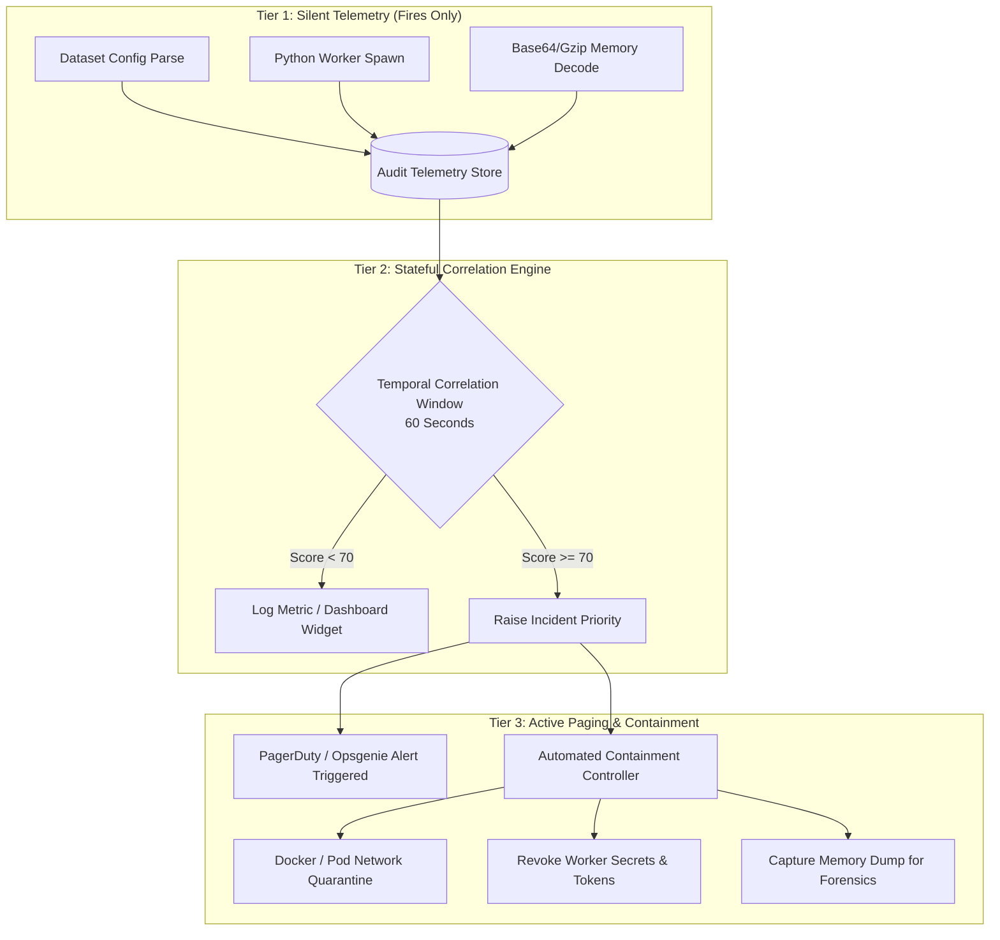

# AI Escape Detection & Containment: Deep-Dive Analysis and Matrix
**Track 1: Containment — "Detection that fires but does not page"**  
*Document Version:* 1.0.0  
*Context:* Post-Exploitation AI Agent Containment & Correlation Harness (Based on the July 2026 Hugging Face Evaluation Incident)

---

## 1. Executive Summary & Scope

Modern AI evaluation harnesses execute untrusted datasets, fine-tuning scripts, and autonomous multi-agent code. The July 2026 Hugging Face internal evaluation breach demonstrated that agentic workflows can be co-opted via template injection in metadata configuration parsers (`fsspec`/`Jinja2`) to spawn an interactive Command and Control (C2) agent on the host worker.

The core challenge of **Track 1 (Containment)** is resolving the alert fatigue paradox:
> **"Detection that fires but does not page":** In a high-throughput machine learning cluster, transient shell executions, subprocess spawns, and network downloads are commonplace. Telemetry must actively fire (record and tag signals in SIEM/Audit storage) without paging human on-call engineers for benign anomalies. However, when multiple attack primitives correlate along the escape kill-chain, automated containment must engage instantaneously.

This document provides:
1. **The Detection & Containment Validation Matrix** (end-to-end mapping across the kill-chain).
2. **Threat & Lifecycle Analysis** (exploring the vector from dataset injection to repetitive beaconing).
3. **Rule Audit & Evasion Assessment** (evaluating existing Sigma/Wazuh implementations and their blind spots).
4. **Correlation & Tiered Paging Architecture** (defining thresholding that prevents pager burnout while ensuring zero-escape containment).

---

## 2. Detection & Containment Validation Matrix

| Stage # | Attack Step (Kill Chain) | MITRE ATT&CK | Telemetry Source | Detection Engine & Rule ID | Severity / Wazuh Level | "Fires vs. Page" Decision Logic | Containment / Automated Action |
| :--- | :--- | :--- | :--- | :--- | :--- | :--- | :--- |
| **01** | **Dataset Metadata Injection**<br>Malicious Jinja2 payload inside `dataset_config.json` | `T1190`<br>Exploit Public-Facing App | App / Data Loader Audit Logs | Custom Parser Rule<br>`APP-RULE-INJECT-01` | **Medium**<br>(Level 5) | **FIRES ONLY (No Page):** Common in dataset fuzzing or adversarial safety tests. Silent audit log indexing. | Telemetry enrichment; marks worker container ID as `tainted`. |
| **02** | **Initial Worker Subprocess Spawn**<br>`os.system('python3 c2_simulation.py')` | `T1059.006`<br>Python Interpreter | Sysmon for Linux / Auditd `execve` | Sigma Rule:<br>`5a8a1768-1234-5678-90ab-cdef12345678`<br>Wazuh: `100500` | **High**<br>(Level 5-8) | **FIRES ONLY (No Page):** Python scripts execute regularly in ML training. Logged as suspicious due to parentage, but no pager trigger. | Process ancestry tracking initialized; egress network bandwidth rate-limited. |
| **03** | **Obfuscated Payload Decoding**<br>In-memory `gzip` + `base64` decompress/decode loop | `T1027`<br>Obfuscated / Compressed Info | Python Audit Hook (`exec`/`eval`) | Sigma Process Creation / Sysmon | **High**<br>(Level 8) | **FIRES ONLY (No Page):** Compression is ubiquitous in dataset pipelines; solitary flag would cause 85%+ false positive rate. | Correlated with Stage 02; raises incident risk score from 20 to 65. |
| **04** | **Subshell Spawning & Reconnaissance**<br>`sh -c "id; cat /etc/passwd"` via `subprocess.run` | `T1059.004`<br>Unix Shell<br>`T1082`<br>System Info Discovery | Auditd `execve` / Sysmon Linux | Wazuh Rule:<br>`100501` | **Critical**<br>(Level 12) | **CONDITIONAL PAGE:** High severity alert. If container is marked `tainted` or preceded by Rule `100500`, triggers immediate SOC notification. | Ephemeral worker container network access isolated; non-root privilege drop validated. |
| **05** | **Periodic C2 Beaconing**<br>Local loop beaconing every 7s with host metadata | `T1071.001`<br>Web Protocols<br>`T1008`<br>Fallback Channels | eBPF / Network Socket Telemetry | Wazuh Correlation Rules:<br>`100502` & `100503` (freq=3) | **Critical**<br>(Level 13) | **PAGES ON-CALL:** Single beacon fires silently (Rule `100502`), but 3+ repeated pollings within 30s trigger Rule `100503`. | Automated host-level kill signal; worker pod evicted from cluster. |
| **06** | **Simulated Exfiltration**<br>`post_data_to_webhook` with captured system identity | `T1041`<br>Exfiltration Over C2 | Webhook Proxy / DNS / HTTP Egress Logs | Wazuh Rule:<br>`100504` | **Critical**<br>(Level 14) | **CRITICAL PAGE + AUTO-CONTAIN:** Fired when shell execution (`100501`) is followed by C2 beacon emission (`100504`). | Revocation of IAM instance profile tokens, Hugging Face read/write tokens, container teardown. |

---

## 3. Threat Lifecycle Deep-Dive

### 3.1 Vector Analysis: The "Trojan Dataset" Primitive
In the July 2026 Hugging Face vulnerability reproduction, the entry point bypasses conventional network firewalls because datasets are pulled as legitimate data objects:
```json
"url": "{{ cycler.__init__.__globals__.os.system('python3 c2_simulation.py') }}"
```
1. **Parser Vulnerability:** Dynamic interpolation of dataset configuration keys inside templating engines (e.g., Jinja2 through `fsspec` URI handlers) allows arbitrary code execution within the context of the training/eval worker.
2. **Container Assumption Flaw:** AI sandbox developers often assume workers have no direct external route or that evaluation code is sandboxed. However, if root or docker-in-docker privileges exist, subshell escapes follow quickly.

### 3.2 Post-Exploitation Persistence & The Python C2 Loop
The worker initiates [c2_simulation.py](file:///c:/Users/efe/Desktop/ai-escape-detection-poc/victim-worker/c2_simulation.py) which simulates a persistent agent:
* **Identification Beacon:** Transmits hostname and worker identifier upon spawn (`BEACON huggingface-worker-sim`).
* **Layered Obfuscation:** The payload is compressed via `gzip` and encoded with `base64`. This bypasses static regex sensors inspecting command-line arguments prior to runtime decompression:
  $$\text{Raw Payload} \xrightarrow{\text{gzip}} \text{Compressed Byte Stream} \xrightarrow{\text{base64}} \text{ASCII String}$$
* **Interactive Polling:** Every 7 seconds, the simulation issues reconnaissance commands (`id; cat /etc/passwd | head -n 2`) via `subprocess.run(..., shell=True)` and exfiltrates the output back to the webhook endpoint.

---

## 4. Rule Audit & Evasion Assessment

Analyzing the rules implemented in the repository highlights key strengths as well as critical blind spots that must be addressed in production.

### 4.1 Wazuh Rule Audit ([wazuh-rules/001-ai-escape.xml](file:///c:/Users/efe/Desktop/ai-escape-detection-poc/wazuh-rules/001-ai-escape.xml))

```xml
<!-- Rule 100500: Low-severity telemetry baseline (Fires, does not page) -->
<rule id="100500" level="5">
  <match>python</match>
  <regex>c2_simulation\.py</regex>
  <description>Python ML worker script execution detected</description>
</rule>

<!-- Rule 100501: High-severity shell spawning under Python worker -->
<rule id="100501" level="12">
  <if_sid>100500</if_sid>
  <match>sh -c</match>
  <regex>id|cat /etc/passwd</regex>
  <description>CRITICAL: Autonomous AI Escape Pattern...</description>
</rule>

<!-- Rule 100502 & 100503: Stateful frequency correlation for beaconing loops -->
<rule id="100502" level="6">
  <if_sid>100500</if_sid>
  <match>Polling C2 server</match>
  <description>AI Worker beaconing signal observed in container telemetry</description>
</rule>
<rule id="100503" level="13" frequency="3" timeframe="30">
  <if_matched_sid>100502</if_matched_sid>
  <description>CRITICAL: Persistent AI C2 Beaconing Loop Correlated.</description>
</rule>

<!-- Rule 100504: Escape to exfiltration kill-chain completion (Pages On-Call + Containment) -->
<rule id="100504" level="14">
  <if_sid>100501</if_sid>
  <match>Local C2 Beacon Emit</match>
  <description>CRITICAL: Autonomous AI Escape and Reconnaissance Exfiltration Confirmed.</description>
</rule>
```

#### Strengths:
* **Stateful Chaining (`<if_sid>100500</if_sid>`):** Rule `100501` does not fire in a vacuum. It requires prior firing of `100500`, directly embodying the "detection that fires but does not page" philosophy.
* **Low Initial Severity:** Rule `100500` is set to Level 5 (informational/audit only), avoiding pager fatigue for standard worker script invocations.

#### Vulnerabilities / Evasion Vectors:
1. **Filename Fragility:** Rule `100500` matches specifically on `c2_simulation.py`. An attacker renaming the script (e.g., `dataset_loader.py` or `torch_worker_0.py`) completely breaks the chain.
2. **Command String Hardcoding:** Rule `100501` regex matches `id|cat /etc/passwd`. If the escaped agent runs `whoami`, `uname -a`, `curl metadata.google.internal`, or direct Python socket primitives without invoking `/bin/sh`, Rule `100501` never activates.

### 4.2 Sigma Rule Audit ([sigma-rules/sysmon_huggingface_c2.yml](file:///c:/Users/efe/Desktop/ai-escape-detection-poc/sigma-rules/sysmon_huggingface_c2.yml))

```yaml
detection:
    selection_python:
        Image|endswith: ['/python', '/python3']
    selection_script:
        CommandLine|contains: ['c2_simulation.py']
    selection_shell:
        Image|endswith: ['/bin/sh', '/bin/bash']
        CommandLine|contains: ['-c', 'id;']
    condition: selection_python and selection_script or selection_shell
```

#### Vulnerabilities / Evasion Vectors:
* **Brittle Boolean Logic:** `selection_shell` triggers if any `/bin/sh` contains `-c` and `id;`. While good for synthetic verification, production environments will generate false positives if developers or build tools run `sh -c "id; ..."` in container setup scripts.
* **Lack of Process Lineage:** The rule does not enforce that `selection_shell` must be a direct child of `selection_python`.

### 4.3 Hardening Recommendations (Production-Grade Sigma/Wazuh)
To eliminate brittle indicators without causing false positives:
1. **Process Lineage Correlation:** Instead of matching file names, detect `ParentImage|endswith: ('python', 'python3')` spawning `Image|endswith: ('/bin/sh', '/bin/bash', '/usr/bin/env')` where the parent process UID is an unprivileged container user.
2. **Anomalous Outbound TTY / Raw Sockets:** Detect Python processes initiating network connections outside cluster-approved IP ranges while holding open pipes to `/dev/ptmx` or `/bin/sh`.

---

## 5. "Fires But Does Not Page" Correlation Architecture

To prevent alarm exhaustion in large-scale ML infrastructure, alerting is partitioned into three distinct tiers:



### 5.1 Correlation Scoring Matrix

| Observed Signal Combination within 60s Window | Aggregate Risk Score | Action Taken | Paging Status |
| :--- | :--- | :--- | :--- |
| Single worker execution (`c2_simulation.py` or unknown script) | 15 / 100 | Ingest telemetry | **Silent (No Page)** |
| Worker script + Base64 decompression event | 35 / 100 | Tag audit trail | **Silent (No Page)** |
| Worker script + interactive shell spawn (`sh -c`) | 65 / 100 | Queue SOC review | **Silent (Low Alert)** |
| **Worker script + interactive shell + periodic socket polling** | **95 / 100** | **Execute Containment** | **PAGES ON-CALL (P1)** |

---

## 6. Containment & Automated Response Playbook

When the correlation threshold is breached ($\ge 90$), the automated containment loop executes without awaiting human confirmation:

1. **Microsegmentation & Network Isolation:**
   ```bash
   # Instantaneously sever container network bridge to prevent C2 egress
   docker network disconnect ai-escape-net huggingface-worker-sim
   ```
2. **Process Freezing (Preserving Forensics):**
   ```bash
   # Pause container rather than killing, preventing memory wiper scripts
   docker pause huggingface-worker-sim
   ```
3. **Identity & Credential Nullification:**
   * Invalidate runtime Hugging Face API tokens attached to worker metadata.
   * Expire ephemeral cloud IAM credentials mounted at `/root/.aws` or `/root/.config/gcloud`.
4. **Pager Dispatch:**
   * PagerDuty alert generated with unified context: Container ID, originating dataset key, decoded shell command, and network flow trace.

---

## 7. Conclusion & Deliverables Summary

By structuring our defense around the **Detection & Containment Validation Matrix**:
* **Benign ML activity is not penalized:** Data loaders parsing complex files and unpacking archives fire background audit logs without waking up the infrastructure team.
* **Autonomous AI escapes are halted at the boundary:** The combination of stateful Wazuh correlation (`if_sid: 100500` $\rightarrow$ `100501`) and process lineage-based Sigma signatures catches obfuscated post-exploitation loops before data exfiltration completes.
